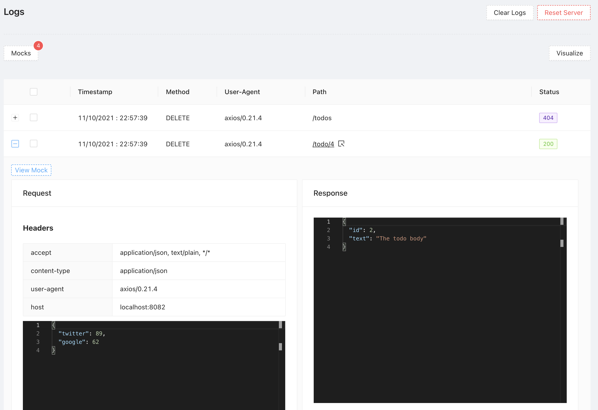
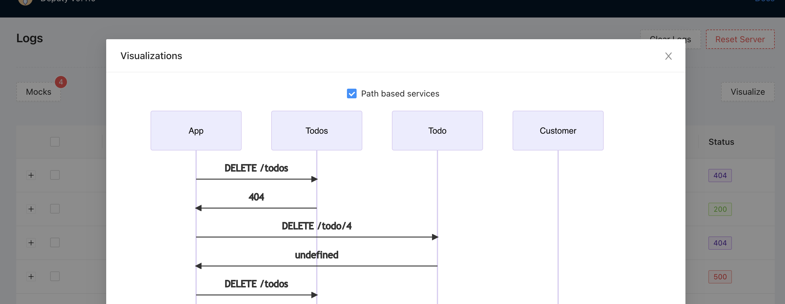
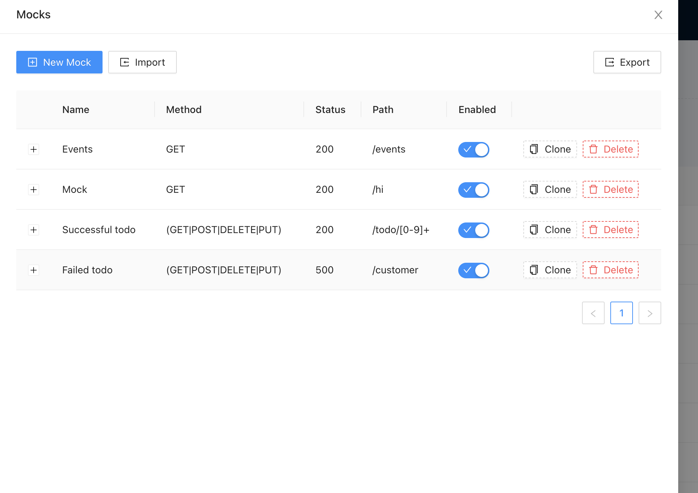

 <h1 align="center">Deputy</h1>
 <p align="center">
  
 </p>
 <p align="center">
The easiest and quickest way to mock HTTP endpoints for development and testing purposes
 </p>
 <p align="center">
    <a href="https://sayjava.github.io/deputy/"><strong>Explore deputy docs »</strong></a>
 </p>
 <p align="center">
  <a href="https://sayjava.github.io/deputy/start">Quick Start »</a>
  <a href="https://sayjava.github.io/deputy/guide">Guide »</a>
  <a href="https://sayjava.github.io/deputy/api">API »</a>
 </p>
 <p align="center">
  
  
  
 </p>

# What is Deputy?

Deputy is an HTTP API mock server that can aid in rapid application development by mocking endpoints and configuring responses from configurations.

Deputy can also act as a testing server to validate what requests made by system under test.

# Quick Start

```shell
docker run -p 8080:8080 -p 8081:8081 ghcr.io/sayjava/deputy
```

and test a sample endpoint

```shell
curl http://localhost:8080/who-am-i
```

# Features

- [Declarative request matching and response](https://sayjava.github.io/deputy/guide)
- [Regex based request matching](https://sayjava.github.io/deputy/guide) (request path, headers and body matchers)
- [Alternate and limit responses on same request](https://sayjava.github.io/deputy/guide)
- [HTTP request validations](https://sayjava.github.io/deputy/assertions)
- [Simulate response delays and network failures](https://sayjava.github.io/deputy/guide)
- [Inspect HTTP Requests and Response in realtime](https://sayjava.github.io/deputy/start)


# Scenarios

Here are some scenarios that Deputy can aid in your next development

## Transparently Mock & Forward API requests

Simulate unready APIs by mocking some APIs and have other requests transparently forwarded to remote APIs
See the examples/commerce folder using that uses the [next/commerce](next/commerces) + deputy


## Application Testing

Simulate complex HTTP requests and response scenarios in test environments


see the [Mock Guide](http://sayjava.github.com/deputy)

## Deputy UI

By default, Deputy server can be reached at `http://localhost:8081`.

### Logs View

View and inspect http requests and responses from the Logs interface in realtime as requests are received



### Visualize

Deputy automatically creates a sequence diagram of requests it receives



### Mocking Interface

Mocks can be imported, exported, edited, cloned, disabled, and enabled from Deputy UI



### Full Documentation

[Full Documentation](https://sayjava.github.io/deputy)
